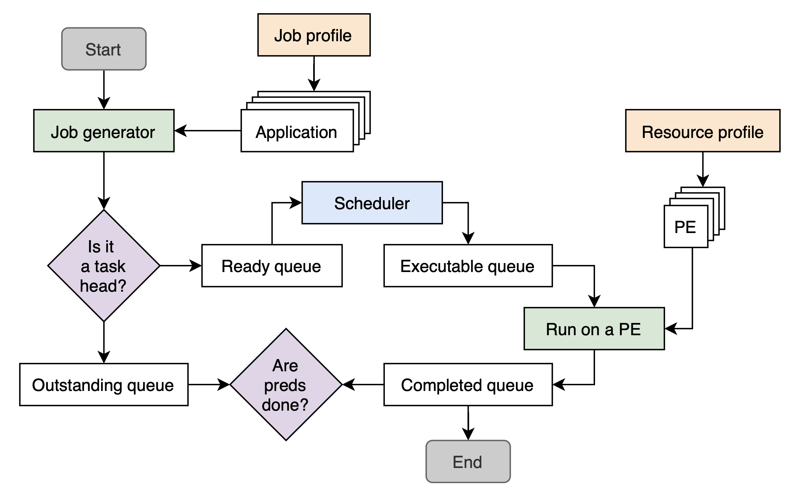
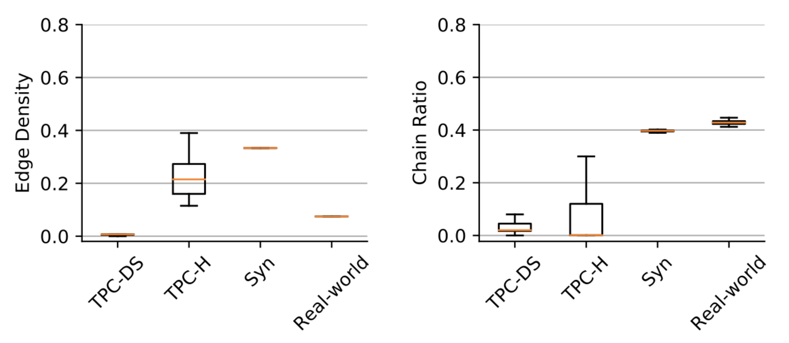
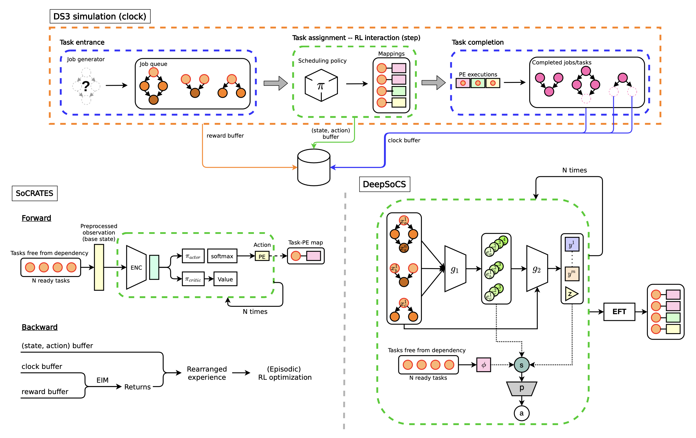
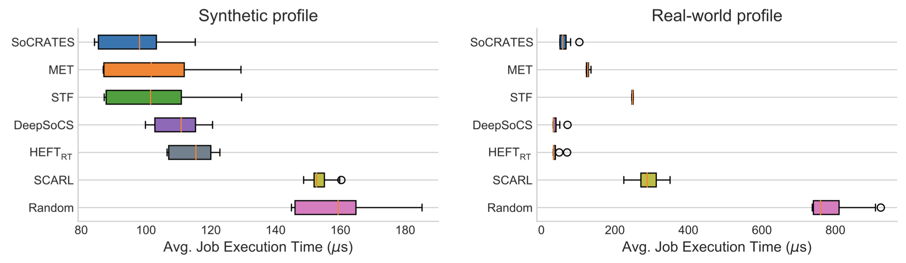
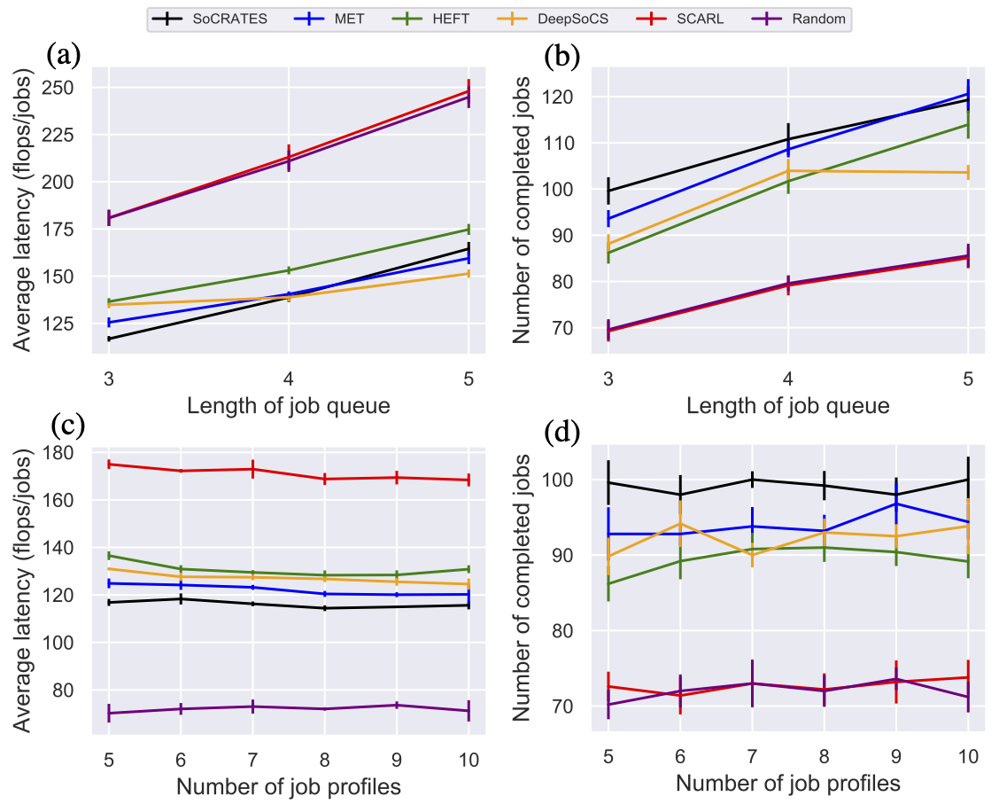

# System-on-Chip Resource Adaptive Scheduling using Deep Reinforcement Learning

SoCRATES, the <u>S</u>ystem-<u>o</u>n-<u>C</u>hip <u>R</u>esource <u>A</u>dap<u>T</u>iv<u>E</u> <u>S</u>cheduling, is a DRL scheduler specializes in scheduling SoC jobs to heterogeneous resources showing the state-of-the-art run-time performance. The Eclectic Interaction Matching technique matches the individual `state-action` tuple with the reward received by the system clock frequency.

Our recent paper, [DRL for SoC: Myths and Realities](https://ieeexplore.ieee.org/document/9874880), investigates the feasibility of neural schedulers for the domain of SoC resource allocation through extensive experiments and comparison with non-neural, heuristic schedulers.

The scheduler runs on the System-on-Chip (SoC) framework. The simulation is developed under [DS3 framework](https://arxiv.org/abs/2003.09016), which is a high-fidelity system-level domain-specific system-on-chip simulation environment. The system provides plug-and-play run-time policy and energy/power modules. The main objective is to optimize performances (i.e., run-time latency, power dissipation, and energy consumption). To enable ease-to-use deep reinforcement learning algorithms, we run scheduling algorithms using [DS3Gym](https://arxiv.org/abs/2104.13187) simulator built with Gym environment for SoC-level task scheduling.
The overall diagram of DS3 and the comparison of job characteristics are illustrated in below.

<div align="center">
  
  <figcaption><b><br>Figure 1: An overview of DS3 workflow.</b></figcaption>
</div>
<div align="center">
  
  <figcaption><b><br>Figure 2: The edge density and chain ratio of cluster and SoC workloads.</b></figcaption>
</div>

An overall systematic workflow of DS3 with scheduling policies is depicted in below.

<div align="center">
  
  <figcaption><b><br>Figure 3: The architecture of neural schedulers applied to DS3 simulator.</b></figcaption>
</div>

The comparison of the DRL algorithms is illustrated in below.

<div align="center">
  
  <figcaption><b><br>Figure 4: An overview of DRL scheduler properties in job injecting frequencies and resource types.</b></figcaption>
</div>

The evaluation of the run-time performances in different algorithms are depicted in below.

<div align="center">
  
  <figcaption><b><br>Figure 5: Overall performances of heuristic and DRL scheduling algorithms.</b></figcaption>
</div>
<div align="center">
  
  <figcaption><b><br>Figure 6: Scalablility analysis on different scheduling algorithms.</b></figcaption>
</div>

## Installation

First, install DS3Gym and the required dependencies, and then install this repository as a Python package.

<b>Requirements</b>
* CPU or NVIDIA GPU, Linux, Python 3.6+
* PyTorch, Python packages; instructions for installing dependencies are followed.

1. Python environment: We recommend using Conda package manager

```bash
conda create -n socrates python=3.6
conda activate socrates
```

2. Install DS3Gym framework and required Python dependencies

```bash
pip install torch numpy
pip install -r requirements.txt
pip install -e .
```


## Usage

This repository supports heuristic and DRL schedulers. To reproduce the results, one can execute the following commands corresponding scheduler.

Currently, we support training agents for CPU only. It takes approximately 1~2 hours for completion.


```bash
python run_socrates_scheduler.py
python run_heuristic_scheduler.py
python run_scarl_scheduler.py
python run_deepsocs_scheduler.py
```


### User customization

A DS3Gym framework allows users to customize different configurations. The supported settings are listed in `config.py`:

* `--resource_profile`: A list of resource profiles
* `--job_profile`: A list of job profiles
* `--scale`: Job frequency (lower scale for fast injection rate)
* `--simulation_length`: A total simulation length for one running episode
* `--scheduler_name`: A name of scheduler (ETF/MET/STF/HEFT/random/SCARL/DeepSoCS/SoCRATES)
* `--max_num_jobs`: A length of job queue
* `--run_mode`: A choice of mode in simulation execution (`run` for standard DS3 framework / `step` for DS3Gym framework)
* `--pss`: A choice of mode for enabling pseudo-steady-state


### Heuristic Schedulers

This repository implemented some of well-known heuristic schedulers: [MET](https://www.researchgate.net/publication/222510982_A_Comparison_of_Eleven_Static_Heuristics_for_Mapping_a_Class_of_Independent_Tasks_onto_Heterogeneous_Distributed_Computing_Systems), [ETF](https://ieeexplore.ieee.org/document/1558639), EFT, [STF](https://www.sciencedirect.com/science/article/abs/pii/S0167739X14002532), and [HEFT](https://ieeexplore.ieee.org/document/993206). 
To run simulations with these schedulers, you can simply give scheduler's name as an argument when running the python code. 


### DRL Schedulers

The presented repository provides DRL-based schedulers: [SoCRATES](https://arxiv.org/abs/2104.14354), [DeepSoCS](https://arxiv.org/abs/2005.07666) and [SCARL](https://ieeexplore.ieee.org/document/8876692). Detailed information for each scheduler are described in below.


#### [SoCRATES](https://arxiv.org/abs/2104.14354) (IEEE ICMLA, 2021)

SoCRATES, the <u>S</u>ystem-<u>o</u>n-<u>C</u>hip <u>R</u>esource <u>A</u>dap<u>T</u>iv<u>E</u> <u>S</u>cheduling, is a DRL scheduler specializes in scheduling SoC jobs to heterogeneous resources showing the state-of-the-art run-time performance. The Eclectic Interaction Matching technique matches the individual `state-action' tuple with the reward received by the system clock frequency.

```bibtex
@inproceedings{sung2021socrates,
  title={SoCRATES: System-on-Chip Resource Adaptive Scheduling using Deep Reinforcement Learning},
  author={Sung, Tegg Taekyong and Ryu, Bo},
  booktitle={2021 20th IEEE International Conference on Machine Learning and Applications (ICMLA)},
  pages={496--501},
  year={2021},
  organization={IEEE}
}
```


#### [DeepSoCS](https://arxiv.org/abs/2005.07666) (Electronics, 2020)

DeepSoCS is a first DRL-based scheduler applied in DS3 framework. By extending [Decima architecture](https://arxiv.org/abs/1810.01963), DeepSoCS rearranges the given tasks using graph neural networks and policy networks. Then, it applies a greedy algorithm to map tasks to available resources. This mechanism similarly operated with HEFT algorithm.

```bibtex
@article{sung2020deepsocs,
  title={DeepSoCS: A Neural Scheduler for Heterogeneous System-on-Chip (SoC) Resource Scheduling},
  author={Sung, Tegg Taekyong and Ha, Jeongsoo and Kim, Jeewoo and Yahja, Alex and Sohn, Chae-Bong and Ryu, Bo},
  journal={Electronics},
  volume={9},
  number={6},
  pages={936},
  year={2020},
  publisher={Multidisciplinary Digital Publishing Institute}
}
```


#### [SCARL](https://ieeexplore.ieee.org/abstract/document/8876692) (IEEE Access, 2019)

SCARL applies [attentive embedding](https://arxiv.org/abs/1706.03762) to policy networks to map jobs to heterogeneous resources in a simple environment. 


## Citation
If you use SoCRLFramework in your work or use any models published in SoCRLFramework, please cite:

```bibtex
@article{sung2022deep,
  title={Deep Reinforcement Learning for System-on-Chip: Myths and Realities},
  author={Sung, Tegg Taekyong and Ryu, Bo},
  journal={IEEE Access},
  volume={10},
  pages={98048--98064},
  year={2022},
  publisher={IEEE}
}
```

```bibtex
@inproceedings{sung2021socrates,
  title={SoCRATES: System-on-Chip Resource Adaptive Scheduling using Deep Reinforcement Learning},
  author={Sung, Tegg Taekyong and Ryu, Bo},
  booktitle={2021 20th IEEE International Conference on Machine Learning and Applications (ICMLA)},
  pages={496--501},
  year={2021},
  organization={IEEE}
}
```

```bibtex
@article{sung2021scalable,
  title={A Scalable and Reproducible System-on-Chip Simulation for Reinforcement Learning},
  author={Sung, Tegg Taekyong and Ryu, Bo},
  journal={arXiv preprint arXiv:2104.13187},
  year={2021}
}
```


## License
SoCRATES is licensed under MIT license available in LICENSE file
