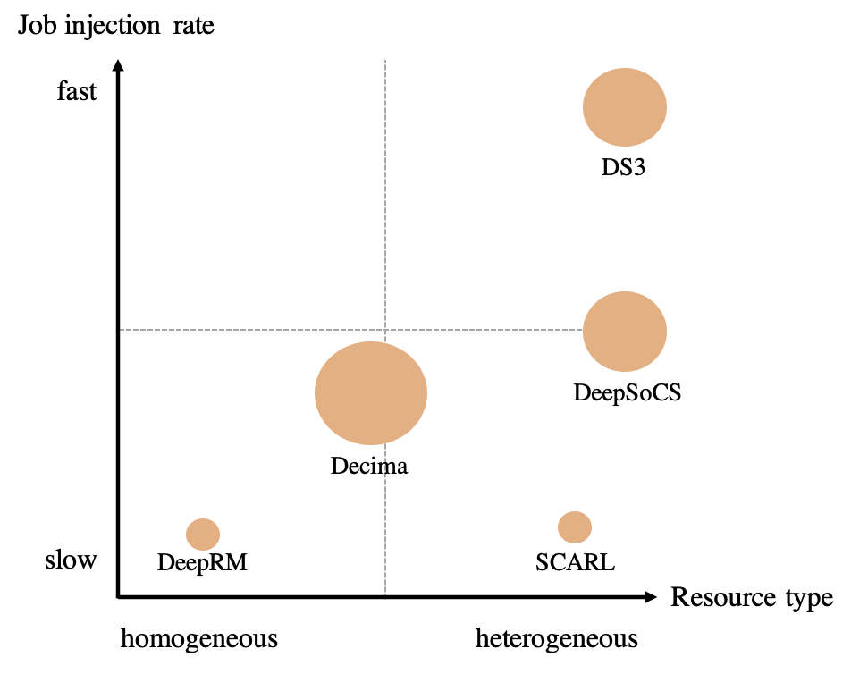

# System-on-Chip Resource Adaptive Scheduling using Deep Reinforcement Learning

SoCRATES, the <u>S</u>ystem-<u>o</u>n-<u>C</u>hip <u>R</u>esource <u>A</u>dap<u>T</u>iv<u>E</u> <u>S</u>cheduling, is a DRL scheduler specializes in scheduling SoC jobs to heterogeneous resources showing the state-of-the-art run-time performance. The Eclectic Interaction Matching technique matches the individual `state-action` tuple with the reward received by the system clock frequency.

The scheduler runs on the System-on-Chip (SoC) framework. The simulation is developed under [DS3 framework](https://arxiv.org/abs/2003.09016), which is a high-fidelity system-level domain-specific system-on-chip simulation environment. The system provides plug-and-play run-time policy and energy/power modules. The main objective is to optimize performances (i.e., run-time latency, power dissipation, and energy consumption). To enable ease-to-use deep reinforcement learning algorithms, we run scheduling algorithms using [DS3Gym](https://arxiv.org/abs/2104.13187) simulator built with Gym environment for SoC-level task scheduling.


## Installation

First, install DS3Gym and the required dependencies, and then install this repository as a Python package.

<b>Requirements</b>
* CPU or NVIDIA GPU, Linux, Python 3.6+
* PyTorch, Python packages; instructions for installing dependencies are followed.

1. Python environment: We recommend using Conda package manager

```bash
conda create -n socrates python=3.6
conda activate socrates
```

2. Install DS3Gym framework and required Python dependencies

```bash
git clone https://github.com/anonymous19583415/SoCRATES
cd SoCRATES
pip install -e .
pip install simpy networkx gym numpy matplotlib
```

3. To run deep reinforcement learning based schedulers, install additional packages. DeepSoCS requires [TensorFlow](https://www.tensorflow.org/), and SoCRATES and SCARL require [PyTorch](https://pytorch.org/). For computation efficiency, we recommend installing a distributed computing package, [Ray](https://ray.io/).

```bash
pip install ray==1.3.0 tensorflow torch==1.8.1 torchvision==0.9.1
```


## Usage

This repository supports heuristic and DRL schedulers. The comparison of the DRL algorithms is illustrated in below.

<div align="center">
  
  <figcaption><b><br>Figure 1: Overview of DRL scheduler properties in job injecting frequencies and resource types.</b></figcaption>
</div>

The evaluation of the run-time performances in different algorithms are depicted in below.

<div align="center">
  
  <figcaption><b><br>Figure 2: Overall performances of heuristic and DRL scheduling algorithms.</b></figcaption>
</div>
<div align="center">
  
  <figcaption><b><br>Figure 3: Scalablility analysis on different scheduling algorithms.</b></figcaption>
</div>

To reproduce the results, one can execute the following commands corresponding scheduler.

```bash
python -m heuristic.run_heuristic_scheduler
python -m scarl.run_scarl_scheduler
python -m deepsocs.run_deepsocs_scheduler
python -m socrates.run_socrates_scheduler
```


### User customization

A DS3Gym framework allows users to customize different configurations. The supported settings are listed in `config.py`:

* `--resource_profile`: A list of resource profiles
* `--job_profile`: A list of job profiles
* `--scale`: Job frequency (lower scale for fast injection rate)
* `--simulation_length`: A total simulation length for one running episode
* `--scheduler_name`: A name of scheduler (ETF/MET/STF/HEFT/random/SCARL/DeepSoCS/SoCRATES)
* `--max_num_jobs`: A length of job queue
* `--run_mode`: A choice of mode in simulation execution (`run` for standard DS3 framework / `step` for DS3Gym framework)
* `--pss`: A choice of mode for enabling pseudo-steady-state


### Heuristic Schedulers

This repository implemented some of well-known heuristic schedulers: [MET](https://www.researchgate.net/publication/222510982_A_Comparison_of_Eleven_Static_Heuristics_for_Mapping_a_Class_of_Independent_Tasks_onto_Heterogeneous_Distributed_Computing_Systems), [ETF](https://ieeexplore.ieee.org/document/1558639), EFT, [STF](https://www.sciencedirect.com/science/article/abs/pii/S0167739X14002532), and [HEFT](https://ieeexplore.ieee.org/document/993206). 
To run simulations with these schedulers, you can simply give scheduler's name as an argument when running the python code. 


### DRL Schedulers

The presented repository provides DRL-based schedulers: SoCRATES, [DeepSoCS](https://arxiv.org/abs/2005.07666) and [SCARL](https://ieeexplore.ieee.org/document/8876692). Detailed information for each scheduler are described in below.


#### [DeepSoCS scheduler](https://arxiv.org/abs/2005.07666) (Electronics, 2020)

DeepSoCS is a first DRL-based scheduler applied in DS3 framework. By extending [Decima architecture](https://arxiv.org/abs/1810.01963), DeepSoCS rearranges the given tasks using graph neural networks and policy networks. Then, it applies a greedy algorithm to map tasks to available resources. This mechanism similarly operated with HEFT algorithm.


#### [SCARL](https://ieeexplore.ieee.org/abstract/document/8876692) (IEEE Access, 2019)

SCARL applies [attentive embedding](https://arxiv.org/abs/1706.03762) to policy networks to map jobs to heterogeneous resources in a simple environment. 


## License
SoCRATES is licensed under MIT license available in LICENSE file
